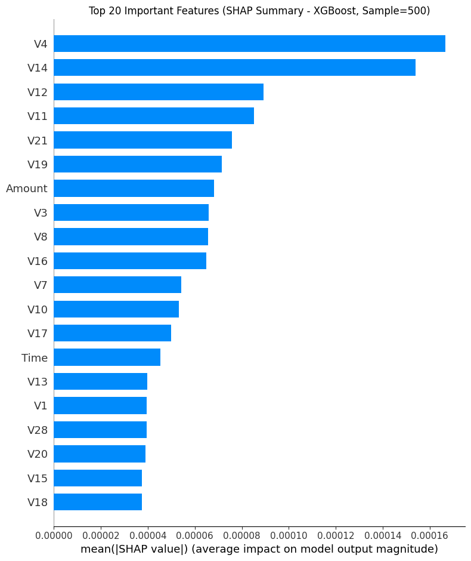
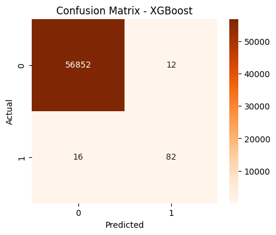
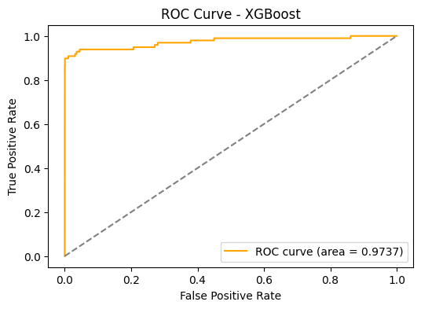

# Credit Card Fraud Detection Using Machine Learning

This project focuses on detecting fraudulent credit card transactions using machine learning techniques. The project was completed as a team-based academic project at Wright State University.

## Project Overview

The main goal of this project was to build and compare machine learning models for identifying fraudulent transactions.

The project includes data preparation, model training, evaluation, and model explainability using SHAP.

## Models Used

The following machine learning models were used in the project:

- Logistic Regression
- Random Forest
- XGBoost

The models were evaluated to understand their performance in detecting fraudulent transactions.

## Model Explainability

SHAP (SHapley Additive exPlanations) was used to understand the predictions made by the XGBoost model.

SHAP visualizations were generated to:

- Identify important features
- Understand how features influence predictions
- Interpret the model's output

## Technologies Used

- Python
- Pandas
- NumPy
- Scikit-learn
- XGBoost
- SHAP
- Jupyter Notebook
- Matplotlib

## Project Work

My contribution to the project included working with the machine learning workflow and model explainability.

Some of the work included:

- Working with the credit card transaction dataset
- Preparing data for machine learning
- Working with different classification models
- Implementing XGBoost
- Applying SHAP for model explainability
- Creating feature-importance and summary visualizations
- Comparing and interpreting model results

## Repository Contents

- credit_card_fraud-detect.ipynb — Jupyter Notebook containing the implementation, analysis, visualizations, and results.
- images/ — Selected project visualizations and model results

The Jupyter Notebook contains the implementation, analysis, visualizations, and results of the project.

## How to Run

1. Download or clone this repository.
2. Open credit_card_fraud-detect.ipynb in Jupyter Notebook or Google Colab.
3. Install the required Python libraries if needed.
4. Run the notebook cells in order.

## Project Information

**Project:** Credit Card Fraud Detection Using Machine Learning  
**Institution:** Wright State University  
**Duration:** Aug 2025 – Dec 2025  
**Type:** Academic Team Project

## Results and Visualizations

### SHAP Feature Importance

### XGBoost Confusion Matrix

### XGBoost ROC Curve

